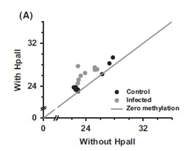
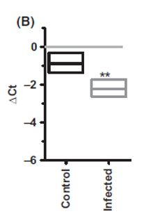
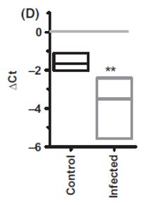

These are some {knitr} options used to format the 
***RMarkdown*** documents in a consistent way. 
I am also reading in all of the packages I will need for my replication in the code below.

```{r setup, include=FALSE}


#library all of the necessary packages not found in base R 
library(tidyverse)
library(ggplot2)
library(dplyr)
library(ggthemes)
library(extrafont)
library(readr)
library(stats)
library(car)
library(mosaic)
library(infer)
library(coin)
library(jmuOutlier)


```


## Introduction 

In this paper the authors Dass et al. investigate the mechanism by which Toxoplasma gondii (a parasitic protozoan) induces behavioral changes in rats. They show that Toxoplasma gondii infections results in a change in the DNA methylation of arginine vasopressin (AVP) within the medial amygdala of male rats. Specifically, they demonstrated that hypomethylation of the AVP promoter caused an increase in AVP expression within infected rats.  This increase in AVT expression results in shocking behavioral changes. (I.e., affiliation to cat urine which assists in parasite’s transmission to its next host, -meow-). 

In order to quantify the difference in AVT methylation between infected and non-infected (control) rats, the authors generated data and conducted analyses which I will be replicating in this project. To briefly summarize, methylation of AVP promoter was quantified using methylation sensitive restriction enzymes (either HpaII or BstUI) in combination with qualitative PCR (internal control = no enzyme treatment for both infected and non-infected groups). These enzymes selectively degrade DNA which is not methylated. Hypomethylation in each enzyme treated assay therefore manifests in reduced production of DNA templet via PCR. 

Due to the degradation of hypomethylated AVP-DNA, infected samples required a greater number of PCR cycles to reach threshold (Ct) compared to infected samples with no methylation sensitive digestion enzymes (8/8 infected rats sampled). Interestingly, DNA samples from control rats NOT infected with Toxoplasma gondii also required a greater number of PCR cycles to reach threshold (Ct) when treated with either HpaII or BstUI compared to no enzyme (7/8 control rats sampled). However, the difference in Ct (Delta-Ct) between enzyme vs no enzyme treatments in control animals was not as large the Delta-Ct observed in experimental animals!  This suggests two things 1) that in non-infected control rats the AVT gene is not completely methylated and 2) that infected rats have substantially more non-methylated AVT.This result was depicted in Fig1A-D for which I will be replicating the visualization. 

For the data illustrated in Fig1A specifically, an arbitrary index of departure from chance (x = y; grey line in Fig. 1A) was calculated as (x - y)2 divided by (x + y)2, where x and y are Ct value without HpaII enzyme and with HpaII enzyme, respectively. They found that among experimental groups, infected animals exhibited greater departure (mean +/- SEM: control = 0.0004 +/- 0.00013, infected = 0.0028 +/- 0.00095; |t14| = 2.45, P = 0.028, independent sample t-test). I will be replicating the descriptive statistic they performed for for Fig1A-B. Also, in an attempt to replicate an inferential statistic from the paper, I will be running a T-test on the data illustrated in Fig1A, as was done in the paper. 

The experimenters went on to conduct behavioral experiments to parse out the consequences of parasite induced AVT-hypomethylation (affiliation to cat urine). They finished by conducting rescue experiments in which infected rates were treated with methionine and aberrant behaviors were abolished. 

For this project, however, I will focus on the results from the first experimental assays and attempt to replicate the data visualizations and statistical analyses the authors used to inform their conclusions. Specifically, I will be replicating 4 data visualizations (Fig1 A-D), 2 inferential statistics (T-test, ANOVA, and exact binomial test), and 4 descriptive statistic (mean and SEM for Control and Infected groups for each enzyme assay). 


##Visualization of Fig1 A and B 


FIGURE 1A SCATTER PLOT REPLICATION 

In the following code chunk I will attempt to replicate the scatter plot shown in Fig1A 

Scatter plot description: Scatter Plot of Ct values (X= Ct without enzyme, Y= Ct with enzyme) for both control (Pink) and infected (Blue) groups. (y = x line indicates equal Ct for both enzyme and non-enzyme treated assays)

```{r}

#importing and visualizing the data set from github repository
#I will begain by define the variable "data" as the data frame corresponding to the CSV file used for Fig1A-B
data <- read_csv("https://raw.githubusercontent.com/lbp576/data-analysis-replication/main/data/fig1AB.csv")

#to view the entire data frame 
data

#view/read data using head() function to see only the first 6 rows
head(data)


#function for setting the theme used for my plot 
set_theme_plotly = function(){
  theme_set(theme_classic())
}


#Scatter plot (Fig1A) for Fig1A (Enzyme: HpaII)
Fig1A <- ggplot(data=data, aes(x=Without_Enzyme, y=With_Enzyme, colour = Infected)) 
Fig1A <- Fig1A + geom_point(size=3, show.legend=TRUE) + xlim(c(20,36)) + ylim(c(20,36))
#geom_line function is used here to indicate zero methylation
Fig1A <- Fig1A + geom_abline()
Fig1A

```

Scatter plot interpretation: Toxoplasma gondii infection resulted in higher Ct value in HpaII enzyme treated assays compared to assays with no enzyme treatment. Both control and infected groups showed increase in Ct values after enzyme treatment; however, the distance from y = x line was larger for data points corresponding to the infected group (Blue) compared to control (Pink). 


Fig 1A scatter plot from paper for comparison: 

```{r echo=FALSE, out.width="70%", message=FALSE}

```


FIGURE 1B BOX PLOT REPLICATION 

In the following code chunk I will attempt to replicate the box plot shown in Fig1B 

Box plot description: Box plot showing the distribution of the numerical data for Delta Ct in either the control or infected groups.  

```{r}

# Box plot (Fig1B) for Fig 1B (Enzyme: HpaII) looking at the distribution of "Change in Ct" as a function of infected status.  
Fig1B <- boxplot(data$Change_in_CT ~ data$Infected,
          ylab="Change in Ct", 
          xlab = "",                        
          main="HpaII boxplot",
          color = "group", 
          col=c("light green","red"))
```

Box plot Interpretation: On average, Toxoplasma gondii infection resulted in larger Delta Ct values (more negative) for data corresponding to infected rats compared to data for rats not infected. This comparatively large Delta Ct seen in the infected group is due to increase in hypomethylation and higher HpaII mediated degradation of non-methlyated AVP-DNA compared to control group. The inter-group difference visualized here is striking: the 75th percentile of Delta Ct values in the infected was placed below the 25th percentile of control animals.     


Fig 1B Box Plot from paper for comparison: 

```{r echo=FALSE, out.width="60%", message=FALSE}

```


##Descriptive Statistic Replication for Fig1A.

Again, for the data illustrated in Fig1A, the authors included an arbitrary index of departure from chance (x = y; grey line in Fig. 1A) was calculated as (x - y)2 divided by (x + y)2, where x and y are Ct value without HpaII enzyme and with HpaII enzyme, respectively. They found that among experimental groups, infected animals exhibited greater departure (mean +/- SEM: control = 0.0004 +/- 0.00013, infected = 0.0028 +/- 0.00095; |t14| = 2.45, P = 0.028, independent sample t-test). In the following code chunk I will be replicating the descriptive statistic and find the mean and standard error in the mean for these data. 


```{r}

#First we need to define our x and y values for each group (Control or Infected) using the filter function to filter the data and the pull function to pull data from a specific column in the data frame.

#Here I am starting with the Control group 

Cx <- data %>% filter(Infected == "Control") %>% pull(Without_Enzyme)
Cy <- data %>% filter(Infected == "Control") %>% pull(With_Enzyme)


#Plugging these variables into the equation the author's used to measure departure (i.e. (x - y)2 divided by (x + y)2) generates a vector I am calling "Departure_Control"
Departure_Control <- ((Cx - Cy)^2 / (Cx + Cy)^2)

#Next take the mean of this vector and assign it a name (M)
M <- mean(Departure_Control)
M

#Next define the standard deviation (sd) which will be used to calculate standard error in the mean or SEM 
sd <- sd(Departure_Control)

#calculate and define standard error in the mean (SEM) 
SEM <- (sd / (8)^0.5) 
SEM


#Repeat these steps for the Infected group
Ix <- data %>% filter(Infected == "Infected") %>% pull(Without_Enzyme)
Iy <- data %>% filter(Infected == "Infected") %>% pull(With_Enzyme)

#define mean (M)
Departure_Infected <- ((Ix - Iy)^2 / (Ix + Iy)^2)
M <- mean(Departure_Infected)
M
#define standard deviation (sd)
sd <- sd(Departure_Infected)

#calculate and define standard error in the mean (SEM) 
SEM <- (sd / (8)^0.5) 
SEM
```

Interpretation of output: 
My output for the mean and SEM for both Control and Infected groups are consistent with the values reported in the paper!  
(mean +/- SEM: control = 0.0004 +/- 0.00013, infected = 0.0028 +/- 0.00095) 


##Inferential Statistic Replication for Fig1A.
In the paper a T-test was allegedly performed on the data used to construct Fig1A but the actual stats reported were actually derived from a different method (Randomized significance testing using REST software). Here I will replicate both, (T-test and randomization) despite the fact that only the latter actually shows up in thier results section.   

```{r fig.keep="last"}

# T-statistic 

#First we need to define our x and y values using the filter function to filter the data via "Control" or "Infected" and the pull function to pull data from a specific column in the data frame.

x <- data %>% filter(Infected == "Infected") %>% pull(Change_in_CT)
y <- data %>% filter(Infected == "Control") %>% pull(Change_in_CT)

#Next use t.test function to run T-test on these two variables 
t.test(x,y)

#An alternative way (from t-test) to compare the two group means (change in Ct for Infected vs Control) is to run an ANOVA
#define "model1" usinf the aov function  
model1 <- aov(Change_in_CT ~ Infected, data=data)
#use the summary function to see a summary of vaules from the ANOVA
summary(model1)


#Empirical test using randomization to test significance of Infected vs Control on Change in Ct 

#define the actual difference in means
actual_diff <- mean(x) - mean(y)

#running permutation
n <- length(data)
nperm <- 10000  # number of permutation simulations
# create a dummy vector to hold results for each permutation
permuted_diff <- vector(length = n)
test_data <- data
for (i in 1:nperm) {
    # scramble the Infected vector `sample()` with a vector as an argument yields a random permutation of the vector
    test_data$Infected <- sample(data$Infected)
    x <- test_data[test_data$Infected == "Infected", ]$Change_in_CT
    y <- test_data[test_data$Infected == "Control", ]$Change_in_CT
    permuted_diff[[i]] <- mean(x) - mean(y)
}


#Making a histogram of the permutation distribution with line indicating test statistic
histogram(as.numeric(permuted_diff), type = "count", xlab = "", ylab = "# Permutations", main = "Histogram of Permutation Distribution")
#add a line using the ladd function
ladd(panel.abline(v = actual_diff, lty = 3, lwd = 2))
#add a lable using the ladd function
ladd(panel.text(x = actual_diff, y = nperm * 0.08, "Test Statistic", srt = 90, pos = 4,
    offset = 1))


#Calculating the P-Value from our permutation using the equation
p <- (sum(permuted_diff >= abs(actual_diff)) +
         sum(permuted_diff <= -abs(actual_diff))) / nperm
p

```


Interpretation of output: 
The histogram I generated illiterates the distribution created from re-shuffling (randomizing) the data 10,000 times as was done by the authors. The line on the histogram shows where our test statistic falls on this distribution. As can see it literally on the very end of the distribution with an associated p-value of .0004 This is much smaller than the p-value of .002 reported in the paper. Perhaps the reason for this difference in P-values lies in how they conducted their randomization. Since there was no details reported on how the REST software actually generates this p-value its hard to say for sure. I think the authors could have done a better job explaining the details of this inferential statistic instead of simply saying "randomization done using REST"  


##Visualization of Fig1 C and D 


FIGURE 1B SCATTER PLOT REPLICATION 

Scatter plot description: Scatter Plot of Ct values (X= Ct without enzyme, Y=Ct with enzyme) for both control (Pink) and infected (Blue) groups. (y = x line indicates equal Ct for both enzyme and non-enzyme treated assays)


```{r}


#importing and visualizing the data set from github repository
#I will begain by define the variable "data" as the data frame corresponding to the CSV file used for Fig1C-D

data2 <- read_csv("https://raw.githubusercontent.com/lbp576/data-analysis-replication/main/data/fig1CD.csv")

#to view the entire data frame 
data2

#to view/read data using head()
head(data2)


#Scatter Plot (Fig1C) for Fig 1C (Enzyme: BstUI)
Fig1C <- ggplot(data=data2, aes(x=Without_Enzyme, y=With_Enzyme, colour = Infected)) 
Fig1C <- Fig1C + geom_point(size=3, show.legend=TRUE) + xlim(c(20,36)) + ylim(c(20,36))
#geom_line function is used here to indicate zero methylation
Fig1C <- Fig1C + geom_abline()
Fig1C
```

Scatter plot interpretation: Toxoplasma gondii infection resulted in higher Ct value in BstUI enzyme treated assays compared to assays with no enzyme treatment. Both control and infected groups showed increase in Ct values after enzyme treatment; however, the distance from y = x line was larger for data points corresponding to the infected group (Blue) compared to control (Pink). 


Fig 1C scatter plot from paper for comparison: 

```{r echo=FALSE, out.width="70%", message=FALSE}
knitr::include_graphics("images/Fig1c.JPG")
```


FIGURE 1D BOX PLOT REPLICATION 

Box plot description: Box plot showing the distribution of the numerical data for Delta Ct in either the control or infected groups this time with BstUI enzyme treatment.  


```{r}


# Box plot (Fig1D) for Fig 1B (Enzyme: BstUI) looking at the distribution of "Change in Ct" as a function of infected status for BstUI treatments. 
fig1D <- boxplot(data2$Change_in_CT ~ data2$Infected,
                 ylab="Change in Ct", 
                 xlab = "",                        
                 main="BstUI boxplot",
                 color = "group", 
                 col=c("light green","red"))

```

Box plot Interpretation: On average, Toxoplasma gondii infection resulted in larger Delta Ct values (more negative) for data corresponding to infected rats compared to data for rats not infected. This comparatively large Delta Ct seen in the infected group is due to increase in hypomethylation and higher HpaII mediated degradation of non-methlyated AVP-DNA compared to control group. The inter-group difference visualized here is striking: the 75th percentile of Delta Ct values in the infected was placed below the 25th percentile of control animals.     


Fig 1D Box Plot from paper for comparison: 

```{r echo=FALSE, out.width="60%", message=FALSE}

```


##Descriptive Statistic Replication for Fig1C. 

For the data illustrated in Fig1C, the authors again included an arbitrary index of departure from chance (x = y; grey line in Fig. 1C) was calculated as (x - y)2 divided by (x + y)2, where x and y are Ct value without BstUI enzyme and with BstUI enzyme, respectively. They again found that among experimental groups, infected animals exhibited greater departure (mean +/- SEM: control = 0.0009 +/- 0.00019, infected = 0.0067 +/- 0.00249; |t14| = 2.39, P = 0.039, independent sample t-test). In the following code chunk I will be replicating the descriptive statistic. 


```{r}


#Again we first need to define our x and y values for each group (Control or Infected) using the filter function to filter the data and the pull function to pull data from a specific column in the data frame.

#Here I am again starting with the Control group 

Cx <- data2 %>% filter(Infected == "Control") %>% pull(Without_Enzyme)
Cy <- data2 %>% filter(Infected == "Control") %>% pull(With_Enzyme)


#Plugging these variables into the equation the author's used to measure departure (i.e. (x - y)2 divided by (x + y)2) generates a vector I am calling "Departure_Control"
Departure_Control <- ((Cx - Cy)^2 / (Cx + Cy)^2)

#Next take the mean of this vector and assign it a name (M)
M <- mean(Departure_Control)
M

#Next define the standard deviation (sd) which will be used to calculate standard error in the mean or SEM 
sd <- sd(Departure_Control)

#calculate and define standard error in the mean (SEM) 
SEM <- (sd / (8)^0.5) 
SEM


#Repeat these steps for the Infected group
Ix <- data2 %>% filter(Infected == "Infected") %>% pull(Without_Enzyme)
Iy <- data2 %>% filter(Infected == "Infected") %>% pull(With_Enzyme)

#define mean (M)
Departure_Infected <- ((Ix - Iy)^2 / (Ix + Iy)^2)
M <- mean(Departure_Infected)
M
#define standard deviation (sd)
sd <- sd(Departure_Infected)

#calculate and define standard error in the mean (SEM) 
SEM <- (sd / (8)^0.5) 
SEM

```

Interpretation of output: 
My output for the mean and SEM for both Control and Infected groups are consistent with the values reported in the paper; however, the mean calculated for the infected group is .0001 than the value reported in the paper (0.0067). This could be due to a small rounding error made by the authors.   
(mean +/- SEM: control = 0.0009 +/- 0.00019, infected = 0.0068 +/- 0.00249


##Summary / Discussion

Overall I really enjoyed the paper and I think the results they obtained were interesting. Replicating the data visualization in their figures was do-able but could have been a lot easier if they had structured their data in a more organized way. By this I mean that their excel file was not structured so that the data columns appear all together. The data are in various columns that are not all located at the top of the excel sheet as one would expect, rather they appear to be copy pasted into the middle of the excel sheet with no particular logical flow for the calculations and analyses they conducted. Also the title of the tabs in the excel sheet (Fig1A, Fig1B, etc.) did not actually correspond to the Figures as they were named in the paper. Due to this lack of organization in the excel sheet I had a really hard time getting the data into R for reproducing the figures from the form which they originally had it. Consequently, I had to copy paste the specific data I would be using for my visualization and statistics into a new, more organized CSV files that could be easily read into R. Alternatively, I could have devised R code with parameters for reading in only select tabs and rows within the tabs; however, this takes considerable time and effort as well. Regardless, they could have structured their data in a way that is more conducive to reproducing their analyses and data visualization. 

Secondly, their descriptive statistics of mean and standard error in the mean (SEM) were, as expected, fairly straightforward. Once it was reorganized, I was able to take the mean and find the SEM for their data. My output values for these were mostly the same as was reported in the paper, with one exception. The reported SEM for the infected group used for the BtsUI assay was off by a factor of .001. This could be due to a rounding error, or it could be due to the method they used for calculating sd and SEM. They did not specify which method they used for calculating SEM but it would have been useful in understanding this small discrepancy. 

Thirdly, regarding the inferential statistic that were reported in the paper, there was a confusing discrepancy between the inferential statistics that they stated were conducted in the "Statistics" section and the actual inferential statistics they used in the "Results" section. This made it challenging to reproduce the inferential statistics since I initially set myself up to replicate one analysis (t-test) but then upon looking at the statistics reported in the "Results" section I noticed they were actually obtaining their values using a different method (randomized significance testing in REST software). Also the p-value I obtained from doing a randomization test in R was much smaller than the P-value they reported. (.0004 vs .002) this could be due to difference in the way they ran their randomization test in REST as opposed to R. Or it could be that they used different data than was actually cherrypicked for publishing. Overall I think they could have been more clear on the exact inferential statistical tests they did for each experimental assay and I think they should have been more consistent in their descriptions of analyses performed in the paper.   


##References 

Hari Dass, Shantala Arundhati, and Ajai Vyas. “Toxoplasma gondii infection reduces predator aversion in rats through epigenetic modulation in the host medial amygdala.” Molecular ecology vol. 23,24 (2014): 6114-22. doi:10.1111/mec.12888


